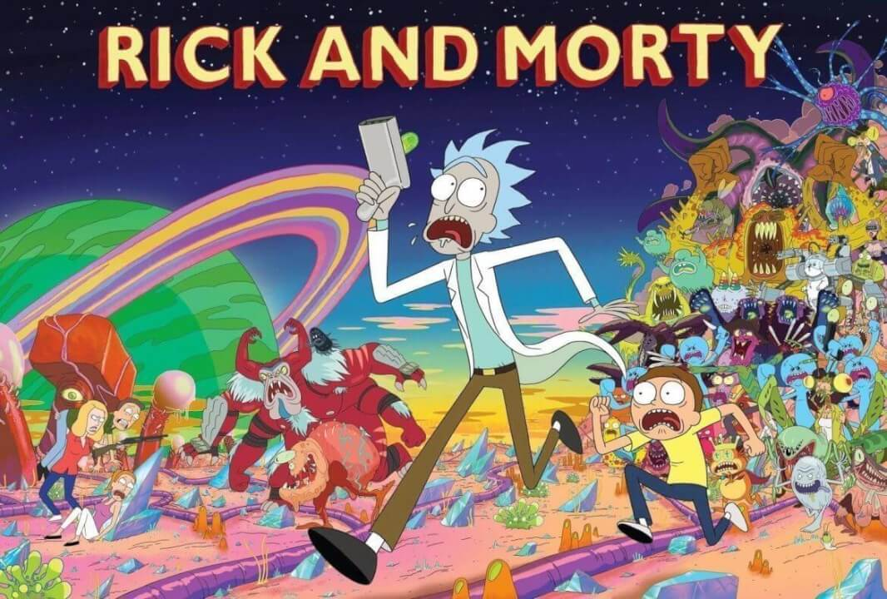
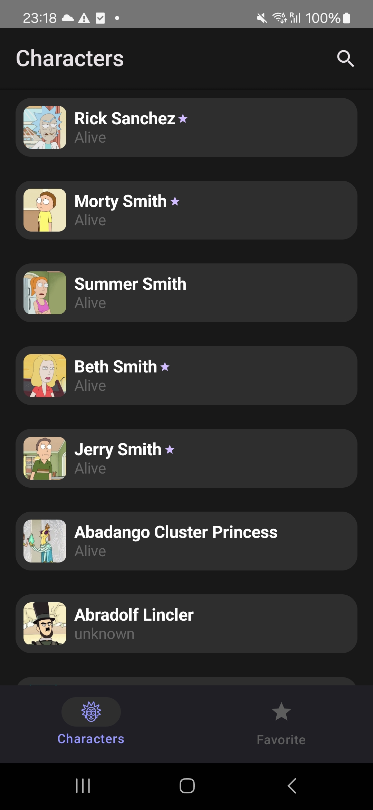
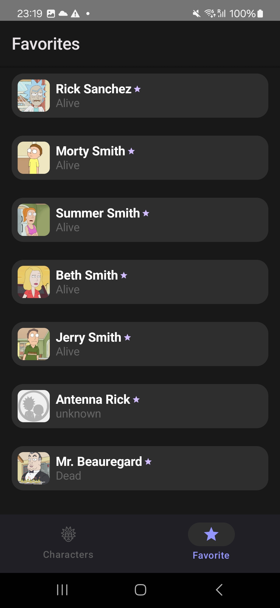
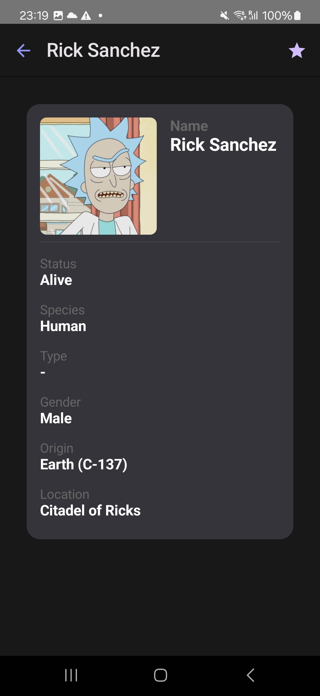
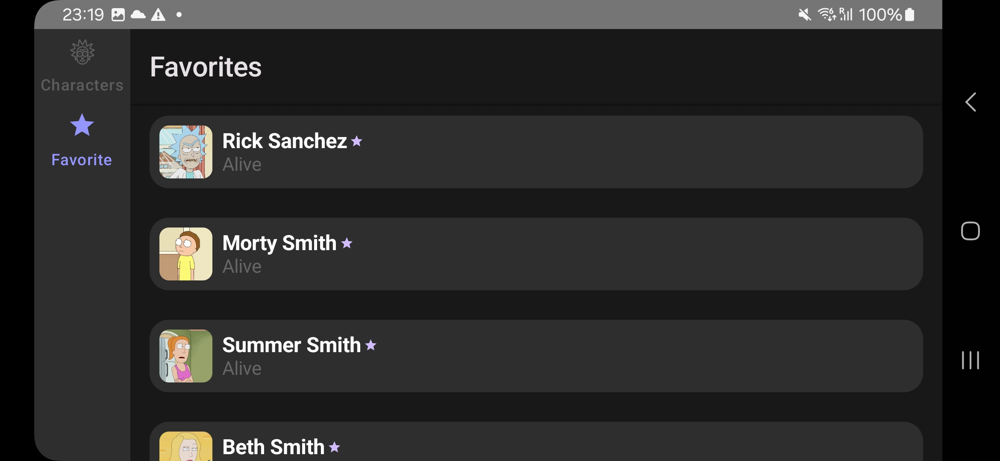
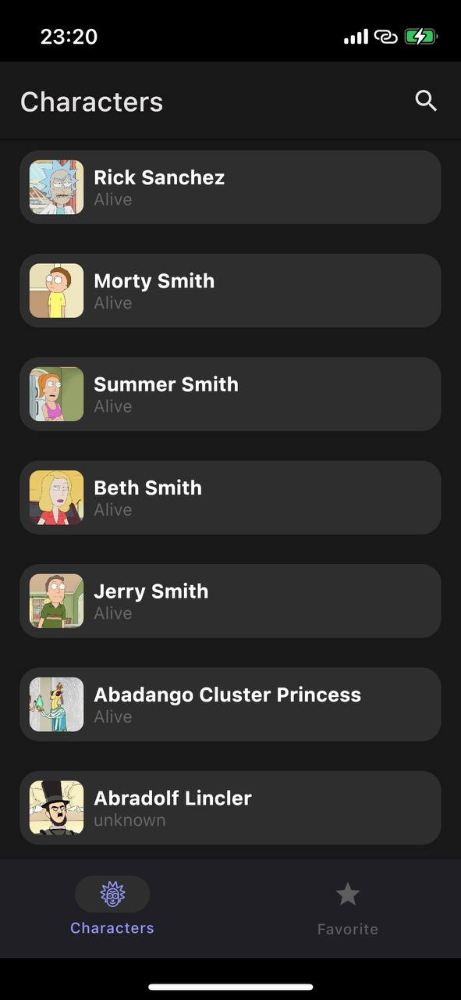
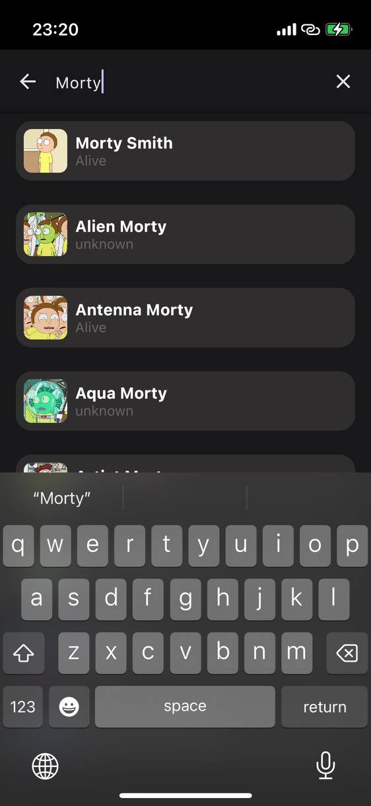
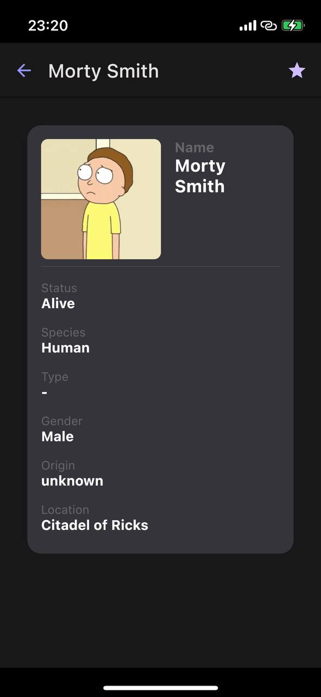
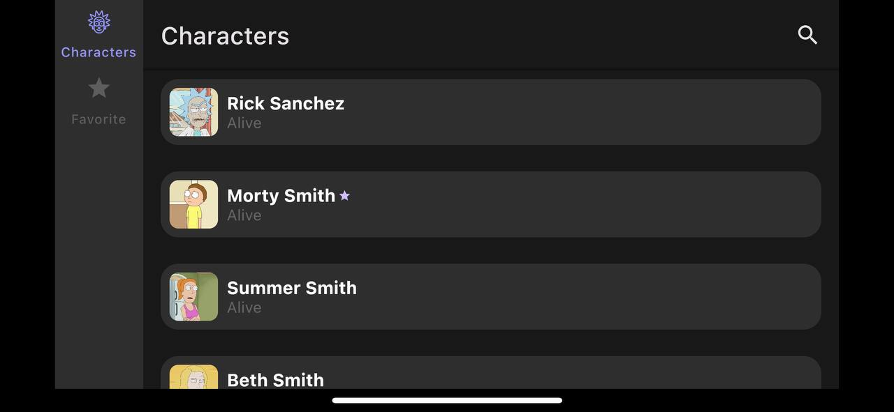

# 🕵️‍♂️ Rick and Morty Showcase

Rick and Morty Showcase is a cross-platform mobile app that displays a catalog of characters from the Rick and Morty universe. Built with Kotlin Multiplatform (KMP), which allows to use the application on both Android and iOS devices.

---
# 🛠️ Tech stack

- **Apollo** – Handles GraphQL queries and parses their responses.
- **SQLDelight** – Manages local database storage on the device.
- **Koin** – Provides lightweight dependency injection.
- **Kotlin Multiplatform** – Enables shared business logic across platforms.
- **Compose Multiplatform** – Used for building declarative UIs across Android and iOS.

---
# 🗂️ Project structure

```
RickAndMortyShowcase/
├── androidApp/       # Android-specific code and resources
├── iosApp/           # iOS-specific code and resources
├── shared/           # Shared Kotlin code (business logic, models, etc.)
│   ├── app/          # Application-level shared logic
│   ├── core/         # Core utilities and abstractions
│   ├── feature/      # Modular features (e.g., roles, game setup)
├── build-logic/      # Included builds for easier dependency management
├── gradle/           # Gradle wrapper and configuration
├── .idea/            # IntelliJ IDEA project settings
├── build.gradle.kts  # Root Gradle build script
├── settings.gradle.kts
└── ...
```

---
# 📸 Previews

## Android






## iOS




